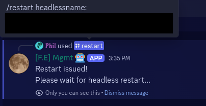
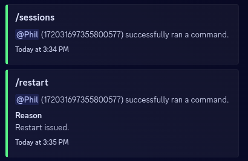
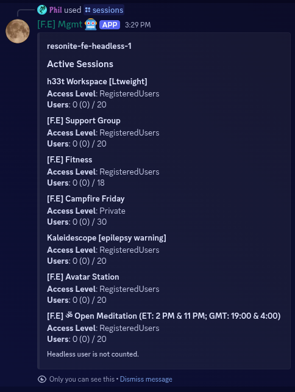
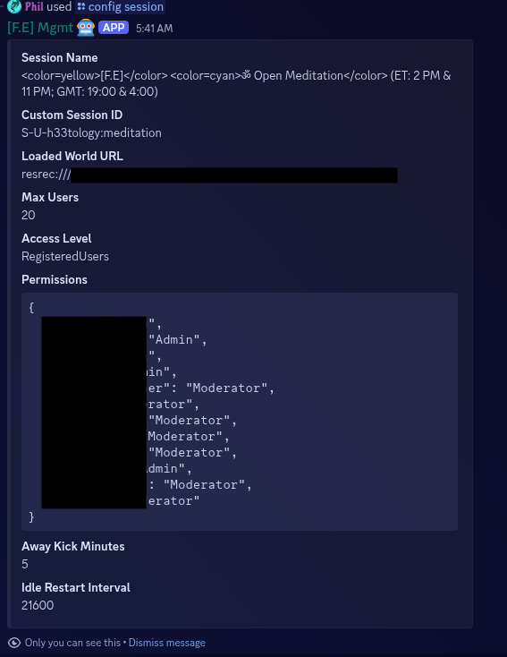
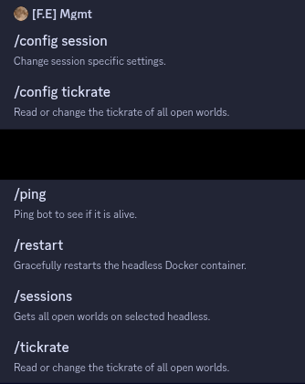

# Resonite Headless Discord Bot

A Discord bot to manage Docker Resonite headless servers without mods.

> [!NOTE]
> The bot is intended to be used with Docker. See the [Resonite Wiki](https://wiki.resonite.com/Headless_server_software/Docker), how to setup a Headless with Docker.

## Features

- Restart headless
- List Sessions
- Change tickrate
- Change world of session
- Show world config
- Command logging

## Screenshots

Restart & Logs            |  Session List   | Session Config
:-------------------------:|:-------------------------:|:-------:
    |   | 

[More Screenshots](https://github.com/FlippedCodes/Resonite-Headless-Discord-Bot/tree/main/assets)

## Table of Contents

- [Resonite Headless Discord Bot](#resonite-headless-discord-bot)
  - [Features](#features)
  - [Screenshots](#screenshots)
  - [Table of Contents](#table-of-contents)
  - [How to use](#how-to-use)
    - [Prerequisites](#prerequisites)
    - [Install](#install)
    - [Usage](#usage)
      - [General](#general)
      - [Restart Command](#restart-command)
      - [World list](#world-list)
  - [Why](#why)
  - [Limitations](#limitations)
  - [Design Choices](#design-choices)
    - [No Mods](#no-mods)
    - [Docker](#docker)
    - [No Database](#no-database)
  - [ToDo-List](#todo-list)

## How to use

### Prerequisites

- [Docker with Docker-Compose](https://docs.docker.com/engine/install/)
- [A Discord Bot](https://docs.discordnet.dev/guides/getting_started/first-bot.html#creating-a-discord-bot)
  - Doesn't require any special permissions;Can be handled with channel permissions
- [A Docker-based Resonite Headless](https://wiki.resonite.com/Headless_server_software/Docker)

### Install

> [!NOTE]
> If you need help setting up this program, hit me up on Discord: `the.phil.`

1. Invite your Bot to your Discord Guild/Server and make sure to create two channels and give it read and send permissions to them:
   1. log-channel: Posts access and error logs, when a command is used or the bot did something on its own
   2. world-list-channel: Used for a list of worlds, the bot will use to change the config. (Will be explained further down.)
2. Create a role for permission management, of who can use the bot.
3. Open the docker compose of your Resonite Headless with your editor of choice (vi/nano/...), add the following labels and adjust the values to their description. [Make sure you have Discord developer mode enabled to get the Discord IDs.](https://cybrancee.com/learn/knowledge-base/how-to-enable-developer-mode-on-discord/)

   1. ```yaml
      labels:
        discordBot: true
        discordBotAccessRole: 0000000000000000000
        discordBotLogChannel: 0000000000000000000
        discordBotWorldListChannel: 0000000000000000000
      ```

4. Download this repo: `git clone https://github.com/FlippedCodes/Resonite-Headless-Discord-Bot`
5. Copy `dist.env` to `.env`: `cp dist.env .env`
6. Open `.env` and update all required values
   1. This file is used for sensitive information like tokens and passwords
7. Open `config.json` and update it as well
   1. `tickrateRange` is the only thing of interest here (so far)
   2. `discordEventMgmt` can be disabled, if not in use.
8. Open `docker-compose.yml` and add your resonite headless config file under `volumes`
   1. Change config-mapping
      1. Left of the `:` is "outside" of the container and right "inside" of the container
      2. Keep the `docker.sock` mapping
      3. The filename "inside" the container needs to match the docker-compose project name
         1. Use `docker compose ls` to list all your project names
      4. You can use the the `resonite-fe` mapping as an example. But this should be removed, before saving the file, cause that one is my mapping and doesn't exist on your system.
   2. Change your [timezone](https://en.wikipedia.org/wiki/List_of_tz_database_time_zones#List)
      1. Thi sis only required, if you use the `discordEventMgmt`-feature
9. Startup your services: `docker compose up -d`
10. ????
11. Check the logs for, if the startup was successful: `docker compose logs -f`
12. PROFIT!!!!

### Usage

#### General

All commands become available to a user, when they have the discord role, that was created in [installation step 2](#install).



Rules:

- All optional commands are used to set an option. If not used, the bot will only display the information back to you.

#### Restart Command

The restart command restarts the docker container without using the headless `shutdown` command. This causes the world to not save, before shutdown!

#### World list

In order to set a world with the `/config session` command a world-list is required and is managed through the channel that was created in [installation step 1.2](#install).

Rules:

- Every world needs to be an individual entry.
- Messages can be created, updated and deleted on the fly, without requiring a restart of the bot.
- Message Layout
  - First line - Title
  - Second line - Description
    - Can be used for an update date.
  - Resrec-link - Has to start with `resrec:///`
  - Tags - Has to start with `tags:`
    - Tags are used to narrow down the world selection for a session **and needs at least one tag in common with the resonite headless world-config** to show up.
  - Additional info can be added below but is irrelevant for the bot
- Adding a ❌ reaction to the message, marks the world as disabled and it wont show up in the drop down list.

Example:

```text
TEST WORLD
Some short Description.
resrec:///U-someuser/R-some-resrec-link
tags:foo,bar
```

## Why

At [Fur.Earthers](https://fur.earthers.net/) we have a lot of hosts, which all need to regularly change worlds or restart the headless in case of mishaps. Because most of the teammember are not familiar with Docker or Linux commands, I created this bot to manage some basic settings of the headless and their sessions through Discord.

## Limitations

There are no limitations known at this time, but the features have to be implemented first.

## Design Choices

### No Mods

Since this belongs to critical infrastructure, that *has* to work, I wanted something that is unlikely to break from upcoming features. Mods on Resonite are quite resilient to do so, but nothing beats good old cli commands and config parsing. This also helps to easily add or remove the bot as desired.

### Docker

I like docker. It's a cheap and easy way to keep applications separate, while having some security for the underlying host OS and offering an API for shenanigans like this project.

### No Database

To keep it simple and usable for multiple discord servers and headless containers, I opted to not have any database to hold the data. This also prevents complicated overwrites protections, in case the config has to be changed manually and the need to more complicated discord-commands.
The Redis DB is required by the Discord.JS Framework Sapphire to have scheduled tasks for upcoming features.

## ToDo-List

- [ ] Refactor Logging
- [ ] Add soft restart feature
  - Checks, if the headless is empty for scheduled restarts
- [ ] Check for headless updates and apply the automatically
- [ ] Write a proper instructions for creating a Discord Bot
